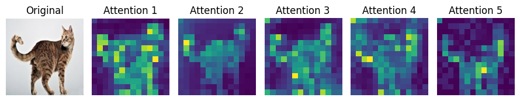

-------------------

# LION 🦁


Linear Transformers and State Space Models have emerged as efficient alternatives to softmax Transformers for causal sequence modeling, enabling parallel training via matrix multiplication and efficient RNN-style inference. However, despite their success in causal tasks, no unified framework exists for applying Linear Transformers to bidirectional sequence modeling. We introduce LION, the first framework to systematically extend Linear Transformers to the bidirectional setting. LION generalizes three core representations commonly used in the causal case—full Linear Attention, bidirectional RNN, and chunkwise parallel form—to the bidirectional setting. These forms are theoretically equivalent and enable models to exploit the strengths of each during training and inference. We prove that a broad class of Linear Transformers can be extended using LION and validate our framework via three core examples based on the choice of decay type: LION-Lit, the bidirectional extension of Katharopoulos et al., 2020; LION-D, based on Sun et al., 2023; and LION-S, a variant using selective decay. Across standard bidirectional tasks, LION enables models to match or exceed the performance of softmax Transformers, while offering significantly faster training and more efficient inference than existing State Space Models.


Using **LION**, we cast many Linear Transformers to their bi-directional form for running examples in code we refer to:  
- **LION-️‍🔥**, the bi-directional variant corresponding to [LinearTransformer](https://arxiv.org/abs/2006.16236).
- **LION-D**, extending [RetNet](https://arxiv.org/abs/2307.08621).
- **LION-S**, a Linear Transformer with a stable selective mask inspired by the selectivity of SSMs like [Mamba🐍](https://arxiv.org/abs/2405.21060).

By replacing the attention block with **LION (-️‍🔥, -D, -S)**, we achieve performance on bi-directional tasks that is comparable to Transformers and State-Space Models (SSMs) while improving training speed.


---

This repository provides the code for the LION model, covering **image classification** and **masked language modeling (MLM)**. Our image classification setup is adapted from [DeiT](https://github.com/facebookresearch/deit), and the MLM implementation builds on [M2-BERT](https://github.com/HazyResearch/m2/tree/main).

# Image Classification



**Setup**: Please follow the instructions from the [DeiT](https://github.com/facebookresearch/deit) library to configure the environment. 

Within the **Image Classification** folder, you’ll find `models_lion.py`, which contains the implementations of **LION-🔥**, **LION-D**, and **LION-S** in three formats: attention, recurrent and chunk-based. We also introduce specialized “curves.py” for processing image patches in **LION-D** and **LION-S**, enhancing spatial representation as discussed in our paper with notation **LION-D/S<sup>♮</sup>**.


Below is an example of how to run **LION-D** for image classification from scratch, followed by a command that demonstrates **LION-S<sup>♮</sup>** training using “curves” and altered patch orders:

```bash
# Example 1: Train LION-D from scratch
python -m torch.distributed.launch --nproc_per_node=4 --use_env main_lion.py \
    --model lion_base_patch16_224 \
    --batch-size 256 \
    --data-path /datapath \
    --output_dir /outputpath
```

```bash
# Example 2: Train LION-S (or LION-D) with curves and patch-order changes
python -m torch.distributed.launch --nproc_per_node=4 --use_env main_lion.py \
    --model lion_base_patch16_224 \
    --batch-size 256 \
    --data-path /datapath \
    --output_dir /outputpath \
    --mask_type Selective \
    --order S \
    --format Attention
```


Inside models_lion, there are 3 sizes defined as:

- LION in base scale (86M) with an image size of 224, called `lion_base_patch16_224`
- LION in small scale (22M) with an image size of 224, called `lion_small_patch16_224`
- LION in tiny scale (5M) with an image size of 224, called `lion_tiny_patch16_224`

Below are some of the key arguments you can customize when training LION-based models:

1. **`pos_emb`**  Enables fixed positional embeddings (as in ViT) (default `False`).  
   - To set True: `--pos_emb`

2. **`cls_tok`**   Uses an independent classification token if set to `True`; otherwise, classification is based on the average pooling of all tokens (default `False`).  
   - To set True: `--cls_tok`

3. **`mask_type`**  Defines how masking or gating is applied. Supported options include `Lit`, `Decay`, and `Selective` which correspond to **LION-🔥**, **LION-D**, and **LION-S** respectively.  
   - Example usage: `--mask_type Decay`

4. **`order`**  Specifies the order in which image patches are processed. Options include:
     - `Normal` (default order)
     - `S` (special ordering)  
   - Example usage: `--order S`

5. **`format`**  Controls the internal representation of the sequence. Valid options are:
     - `Attention` (standard attention-like format)
     - `RNN` (recurrent-like format)
     - `Chunk` (chunk-based approach)  
   - Example usage: `--format Attention`

6. **`chunk_size`**   An integer that sets the size of chunks when using chunk-based processing.  
   - Example usage: `--chunk_size 64`

By combining these arguments, you can experiment with different positional embeddings, classification tokens, patch orders, and masking mechanisms to adapt the LION model to your specific tasks and preferences.


**Notes:**  
- Choose any desired size (e.g., `lion_base_patch16_224`, `lion_small_patch16_224` or `lion_tiny_patch16_224`).  
- By changing the `mask_type`, get different **LION** variants (e.g., LION-🔥, LION-D or LION-S).
- Determine the internal representation format with `format` (e.g., `Attention` for training, `RNN` or `Chunk` for inference).
- Adjust `nproc_per_node`, `batch-size`, `data-path`, and `output_dir` according to your hardware setup and dataset location.  
- The additional flags (`order`, `pos_emb`, `cls_tok`) control the specific training variations (e.g., changing patch-order “S,”, adding positional embeddings and using a classification token).
- As our codebase extends [DeiT](https://github.com/facebookresearch/deit), you can easily distill **RegNET** into a **LION** model by following the **same** distillation commands used for DeiT—just swap in the LION model name. This ensures you can leverage the established DeiT distillation process without additional modifications.

Below are the results on Image Classification with ImageNet-1K for LION models vs benchmarks. 

| Model | #Param | ImageNet Top-1 Acc. | Train. time |
|-------|--------|---------------------|------------|
| $\text{ViT}$ | 86M | $77.9$ | $\times 1$ |
| $\text{DeiT}$ | 86M | $\underline{81.8}$ | $\times 1$ |
| $\text{Hydra}$ | 104M | $81.0$ | $\times 2.51$ |
| $\text{Vim}$ | 98M | $\mathbf{81.9}$ | $\times 10.86$ |
| $\text{LION-}\text{🔥}$ | 86M | $74.7$ | $\mathbf{\times 0.73}$ |
| $\text{LION-D}$ | 86M | $77.8$ | $\times \underline{1.39}$ |
| $\text{LION-D}^{\natural}$ | 86M | $80.2$ | $\times 1.48$ |
| $\text{LION-S}$ | 86M | $76.3$ | $\times 1.46$ |
| $\text{LION-S}^{\natural}$ | 86M | $79.9$ | $\times 1.68$ |


-------------------
# Masked Language Modeling (MLM)

### Dependencies

To install the dependencies, run `pip install -r requirements.txt`.

### Data

In order to download the C4 dataset, run `src/convert_dataset.py`. 

### Pretraining

Select the according `config.yaml` file from the `yamls/pretrain` folder. Make sure to modify the `data_local` path to match the location of the C4 dataset on your machine.

To pretrain the model, run `main.py` with the desired configuration file. For example, to pretrain a Lion-Lit-Large model, run

```bash
composer main.py yamls/pretrain/lion-lit-large.yaml
```


### Finetuning

Select the according `config.yaml` file from the `yamls/finetune-glue` folder. Make sure to modify the `starting_checkpoint_load_path` to match the location of the checkpoint of the pretraining run you want to finetune.

To finetune the model, run `glue.py` with the desired configuration file. For example, to finetune a Lion-Lit-Large model on GLUE, run 

```bash
python3 glue.py yamls/finetune-glue/lion-lit-large.yaml
```

Below are the results on MLM with C4 Dataset for LION models vs benchmarks. 


| Model | MLM Acc. | GLUE | Train. time |
|-------|----------|------|-------------|
| BERT | $\underline{69.88}$ | $\mathbf{82.95}$ | $\times 1$ |
| Hydra | $\mathbf{71.18}$ | $\underline{81.77}$ | $\times 3.13$ |
| <span style="background-color: rgb(230, 255, 230); padding: 3px; color:black">LION-🔥 </span> | $67.11$ | $80.76$ | $\times \mathbf{0.95}$ |
| <span style="background-color: rgb(229, 204, 230); padding: 3px; color:black">LION-D </span> | $68.64$ | $81.34$ | $\times \underline{1.10}$ |
| <span style="background-color: rgb(255, 233, 211) ; padding: 3px; color:black">LION-S </span> | $69.16$ | $81.58$ | $\times 1.32$ |


